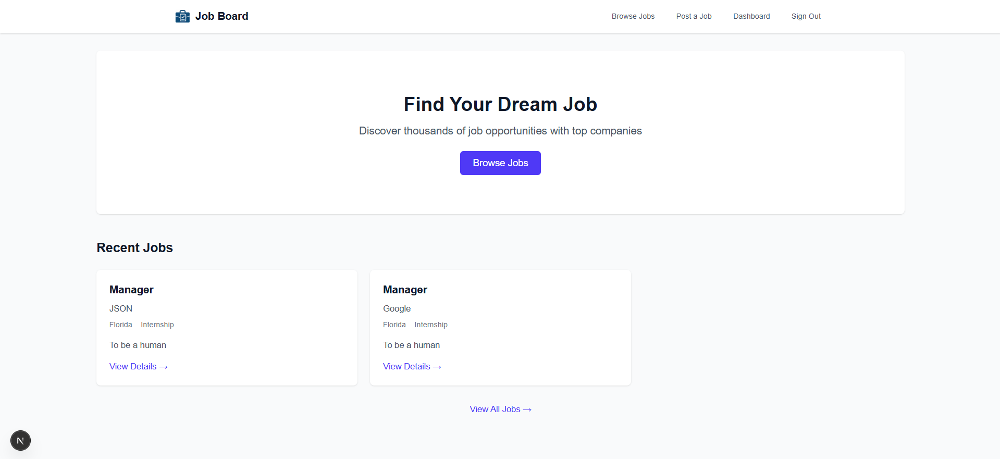
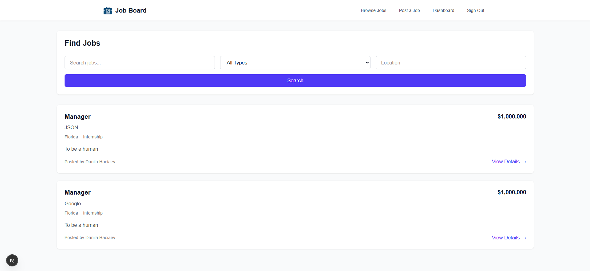
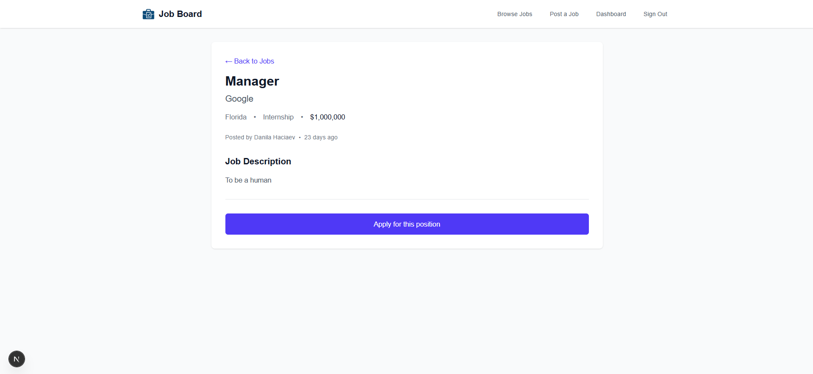
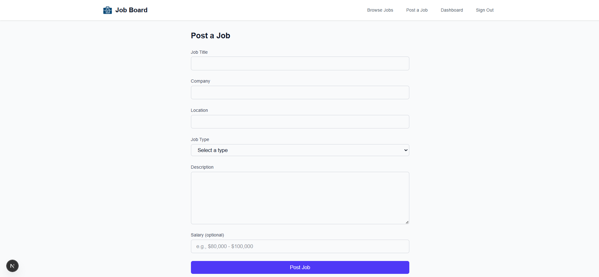
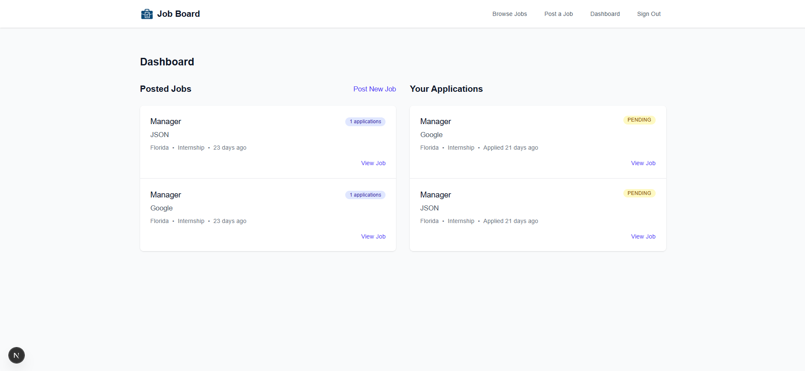
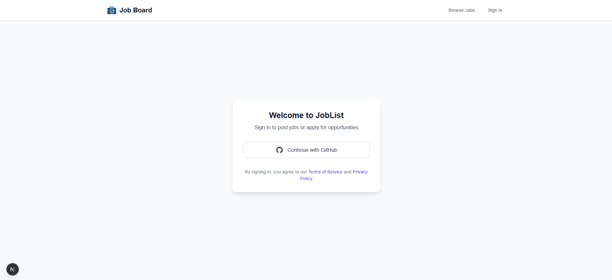

# Job Posting Website

A website for searching and posting job vacancies. Users can browse current job openings and send applications directly to employers. They can also see which companies they have already applied to. Employers can easily post new job listings.  

The website is suitable for quick job search and easy application submission, as well as for employers who want to post vacancies without complex setups.

---

## Technologies

- **Next.js** – frontend and server-side framework.  
- **Prisma** – database ORM.  
- **PostgreSQL** – storage for job listings and applications.  
- **Tailwind CSS** – interface styling.  

---

## Screenshots

Home page:  

All job listings:  

Specific job page:  

Job posting form:  

Employer dashboard:  

User registration:  
